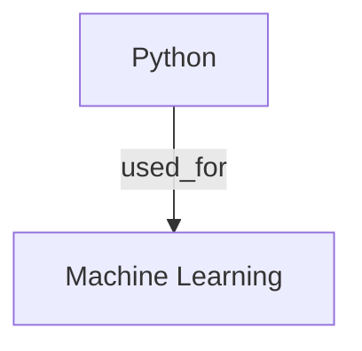

## Knowledge Graph Gradio Interface

**Interactive web interface for exploring knowledge graphs in your RAG system!**

### 🚀 Launch

```bash
./start_gradio_kg.sh
```

Or with manual URL:
```bash
./start_gradio_kg.sh no-browser
```

Then open the displayed URL in your browser.

### ✨ Features

#### 1. Dual Mode Operation

**Regular RAG Mode:**
- Standard semantic search
- Fast processing
- No graph extraction

**Knowledge Graph Mode:**
- Automatic entity extraction
- Relationship detection
- Graph-aware queries
- Visual exploration

**Toggle between modes** using the checkbox at the top!

#### 2. Five Interactive Tabs

##### 💬 Query Documents
- Ask natural language questions
- **Graph-aware queries**: Toggle to include relationship context
- Adjustable parameters (top_k, max_tokens)
- Save results to files
- See extracted entities in sources (Graph Mode)

##### 🔍 Semantic Search
- Find relevant chunks without LLM
- View similarity scores
- See entities in results (Graph Mode)

##### 🕸️ Knowledge Graph (Graph Mode Only)

**Three Subtabs:**

1. **🏷️ Entities**
   - List all extracted entities with frequencies
   - Visual bar chart of entity counts
   - Search for chunks containing specific entities
   - Find all mentions of a concept

2. **🕸️ Traversal**
   - Start from any entity
   - Explore connected entities
   - Adjustable hop distance (1-5 levels)
   - See all relationships in subgraph

3. **📊 Visualization**
   - ASCII art visualization (terminal-friendly)
   - Mermaid diagram (copy to mermaid.live)
   - Interactive HTML (D3.js, opens in browser)
   - Automatic file saving

##### 📁 Data Management
- Load documents from `data/` folder
- Automatic graph extraction (when mode enabled)
- View loading statistics

##### ❓ Help
- Complete usage instructions
- Mode comparison
- Tips and troubleshooting

### 📊 Screenshot Guide

#### Main Interface

```
┌─────────────────────────────────────────────────────────┐
│ 🤖 RAG System - Knowledge Graph Interface              │
├─────────────────────────────────────────────────────────┤
│ System Mode: [ ] Enable Knowledge Graph Mode           │
├─────────────────────────────────────────────────────────┤
│ Tabs: 💬 Query | 🔍 Search | 🕸️ Graph | 📁 Data | ❓   │
└─────────────────────────────────────────────────────────┘
```

#### Knowledge Graph Tab

```
┌─── 🕸️ Knowledge Graph ────────────────────────────┐
│                                                    │
│  Subtabs: 🏷️ Entities | 🕸️ Traversal | 📊 Viz   │
│                                                    │
│  📋 List All Entities                             │
│  ┌─────────────────────────────────────────────┐  │
│  │ 🏷️ All Entities (25 total):                │  │
│  │                                             │  │
│  │ `Python` ████████████ (12)                 │  │
│  │ `Machine Learning` █████████ (9)           │  │
│  │ `Neural Networks` ██████ (6)               │  │
│  │ ...                                         │  │
│  └─────────────────────────────────────────────┘  │
│                                                    │
│  🎯 Search by Entity                              │
│  Entity Name: [____________]                      │
│  [Find Chunks with Entity]                        │
└────────────────────────────────────────────────────┘
```

### 🎯 How to Use

#### Quick Start

1. **Launch the interface:**
   ```bash
   ./start_gradio_kg.sh
   ```

2. **Choose your mode:**
   - ☐ Regular RAG (fast, standard)
   - ☑ Knowledge Graph Mode (enhanced, extracts entities)

3. **Load documents:**
   - Go to "📁 Data Management" tab
   - Click "Load from data/ folder"
   - Wait for processing

4. **Explore!**
   - Ask questions in "💬 Query" tab
   - Browse entities in "🕸️ Knowledge Graph" tab
   - Visualize relationships

#### Workflows

**Workflow 1: Quick Q&A (Regular Mode)**
```
1. Keep Graph Mode disabled
2. Load documents
3. Ask questions
4. Get fast answers
```

**Workflow 2: Deep Knowledge Exploration (Graph Mode)**
```
1. Enable Knowledge Graph Mode
2. Load documents (entities extracted)
3. Go to Knowledge Graph tab
4. List all entities
5. Pick an interesting entity
6. Traverse from that entity
7. Visualize the subgraph
8. Ask graph-aware questions
```

**Workflow 3: Entity-Focused Research**
```
1. Enable Graph Mode
2. Load documents
3. Know a specific entity (e.g., "Python")
4. Search by entity in Graph tab
5. See all chunks mentioning it
6. Traverse to find related concepts
7. Query with graph context
```

### 🔧 Configuration

#### Mode Comparison

| Feature | Regular RAG | Graph RAG |
|---------|-------------|-----------|
| Processing Speed | Fast | Slower (LLM extraction) |
| Entity Extraction | No | Yes |
| Relationship Detection | No | Yes |
| Graph Traversal | No | Yes |
| Graph Visualization | No | Yes |
| Graph-Aware Queries | No | Yes |
| Database Location | `outputs/chroma_db/` | `outputs/chroma_graph_db/` |

#### Performance Tips

**For Speed:**
- Use Regular RAG mode
- Smaller top_k values
- Load fewer documents

**For Depth:**
- Use Graph RAG mode
- Larger top_k values
- Enable graph context in queries

### 📁 File Locations

```
outputs/
├── chroma_db/                    # Regular RAG database
├── chroma_graph_db/              # Graph RAG database
├── query_YYYYMMDD_HHMMSS.txt    # Saved query results
└── graph_visualization.html      # Interactive graph viz
```

### 🎨 Visualization Options

#### 1. ASCII Art (In-Browser)
```
Knowledge Graph Summary
============================================================

Top Entities:
------------------------------------------------------------
Python                         ████████████ (12)
Machine Learning               █████████ (9)
Neural Networks                ██████ (6)

Relationships:
------------------------------------------------------------
[is_a] (5 relations):
  • Python → programming language
  • Machine Learning → AI subset
  ...
```

#### 2. Mermaid Diagram

Copy to [mermaid.live](https://mermaid.live) for visualization!

#### 3. Interactive HTML (D3.js)
- Drag nodes to rearrange
- Zoom and pan
- Click entities to highlight
- Saved to `outputs/graph_visualization.html`

### 💡 Use Cases

#### 1. Research Literature Review

```
1. Enable Graph Mode
2. Load research papers from data/
3. List all entities (concepts, methods, authors)
4. Pick a methodology
5. Traverse to find related methods
6. Visualize the research landscape
```

#### 2. Technical Documentation

```
1. Load API docs
2. List all class/function entities
3. Search for specific class
4. Traverse to find related classes
5. Query about usage patterns with graph context
```

#### 3. Business Knowledge Base

```
1. Load company documents
2. Extract product/service entities
3. Find relationships between offerings
4. Visualize product ecosystem
5. Answer customer questions with graph context
```

### 🔍 Example Session

**Step 1: Enable Graph Mode**
```
☑ Enable Knowledge Graph Mode
```

**Step 2: Load Documents**
```
📁 Data Management → Load from data/ folder
✅ Loading Complete!
   Files Processed: 3
   Chunks Added: 15
   Mode: 🕸️ Graph RAG (with entity extraction)
```

**Step 3: View Entities**
```
🕸️ Knowledge Graph → 🏷️ Entities → List All Entities

🏷️ All Entities (12 total):
`Python` ████████ (8)
`RAG` ██████ (6)
`ChromaDB` ████ (4)
`embeddings` ███ (3)
...
```

**Step 4: Traverse from Python**
```
🕸️ Traversal
Starting Entity: Python
Max Hops: 2
[Traverse Graph]

🕸️ Graph Traversal from: `Python`
Connected Entities: 8
  • Python
  • RAG
  • embeddings
  • Machine Learning
  ...

Relationships (5 total):
  • `Python` --[used_for]--> `RAG`
  • `Python` --[supports]--> `embeddings`
  ...
```

**Step 5: Visualize**
```
📊 Visualization → Generate Visualizations

[ASCII Art displayed]
[Mermaid code shown]
📊 Interactive Visualization:
   Saved to `outputs/graph_visualization.html`
```

**Step 6: Ask Graph-Aware Question**
```
💬 Query Documents
Question: How is Python used in RAG systems?
☑ Use graph context
[Ask Question]

Answer: Python is extensively used in RAG systems...
[Includes relationship context from graph]
```

### 🆚 Comparison with Command Line

**Gradio Interface:**
- ✅ Visual, interactive
- ✅ No code required
- ✅ Real-time visualization
- ✅ Easy mode switching
- ✅ Perfect for exploration

**Command Line (examples/knowledge_graph_demo.py):**
- ✅ Programmatic control
- ✅ Automation friendly
- ✅ Customizable
- ✅ Integration with other tools
- ✅ Perfect for development

### 🐛 Troubleshooting

**"Graph mode not enabled"**
- Check the toggle at the top of the page
- Refresh after toggling

**"No entities found"**
- Make sure Graph Mode is enabled BEFORE loading documents
- Re-load documents with Graph Mode on

**"Visualization empty"**
- Load documents first
- Ensure Graph Mode was enabled during loading

**Slow processing**
- LLM extraction takes time (~1-2 sec per chunk)
- Use pattern-based extraction for speed (requires code change)
- Or use Regular RAG mode

**Browser doesn't open**
- Use `./start_gradio_kg.sh no-browser`
- Manually visit displayed URL

### 📚 Related Documentation

- [KNOWLEDGE_GRAPH_GUIDE.md](KNOWLEDGE_GRAPH_GUIDE.md) - Complete API guide
- [CUSTOM_EMBEDDINGS.md](CUSTOM_EMBEDDINGS.md) - Embedding providers
- [examples/knowledge_graph_demo.py](examples/knowledge_graph_demo.py) - Code examples

### 🎉 Summary

The Knowledge Graph Gradio Interface provides:

✅ **Visual exploration** of your knowledge graph
✅ **No-code interface** for entity search and traversal
✅ **Graph-aware queries** with enhanced context
✅ **Multiple visualizations** (ASCII, Mermaid, HTML)
✅ **Easy mode switching** between Regular and Graph RAG
✅ **Interactive web UI** - no programming required!

**Perfect for:**
- 🔬 Researchers exploring literature
- 📚 Knowledge base management
- 🏢 Business intelligence
- 📖 Documentation navigation
- 🎓 Learning and education

---

**Start exploring your knowledge graphs visually!**

```bash
./start_gradio_kg.sh
```
